## **Our Research Question**

To what extent do technology, tourism, pharmaceutical, and energy stocks differ in terms of their price volatility and recovery dynamics during and after the COVID-19 pandemic?

\newpage

## Data Extraction and Cleaning

**Stock Market Data**

-   **Source Yahoo Finance** –\> accessed via `quantmod` package in R

-   **Type of data:** Daily Stock Prices from January 2019 until December 2023

-   **Stocks used:**

1.  Apple Inc. (AAPL) – Technology

2.  BioNTech SE (BNTX) – Pharmaceutical

3.  Deutsche Lufthansa AG (LHA.DE) – Tourism/Aviation

4.  Shell plc (SHEL) – Energy

\newpage

## Example Stock

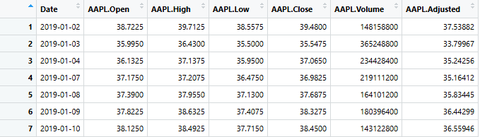{width="75%" fig-align="center"}

-   Limit to closing values and extracting them

-   Combining all Stocks closing Value in one table –\> difficulties due to differing in number of rows

-   Solution for that was instead of combining vectors directly, all time series were first aligned by date using `merge()` on `xts` objects. Missing trading days were handled via `NA` values.

\newpage

## Combined Stock List

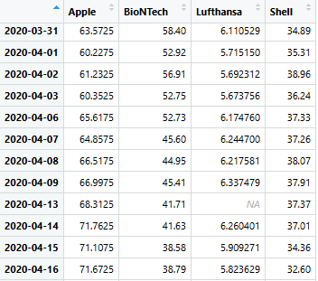

```{r eval=FALSE,echo=TRUE}
# Merging all closing-price time series by Date (keeps all dates; missing values become NA)
merged <- merge(LHA_cl, BNTX_cl, AAPL_cl, SHEL_cl, all = TRUE)
```

\newpage

## COVID-19 Dataset (John Hopkins University)

**Data type:** Daily confirmed COVID cases, continuously updated and well known for academic research and policy analysis

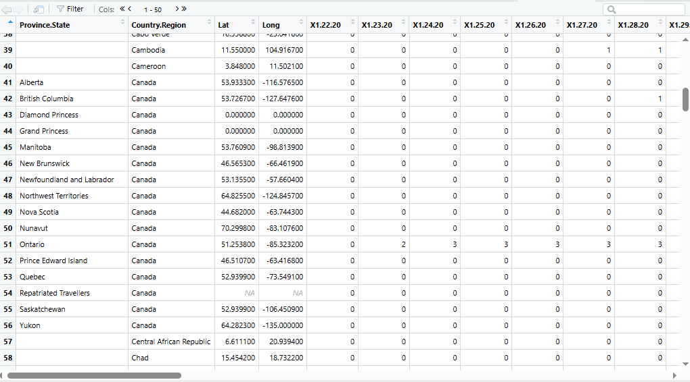{width="90%" height="65%" fig-align="center"}

\newpage

## Cleaning of COVID Data

-   Changing from Wide Format –\> long Format, so every row corresponds

-   Provincial –\> country aggregation

-   Cumulative –\> daily values

-   Global aggregation

    **Final COVID Dataset: Daily global confirmed cases, daily global deaths & time index**

\newpage

## Visualization of COVID Data

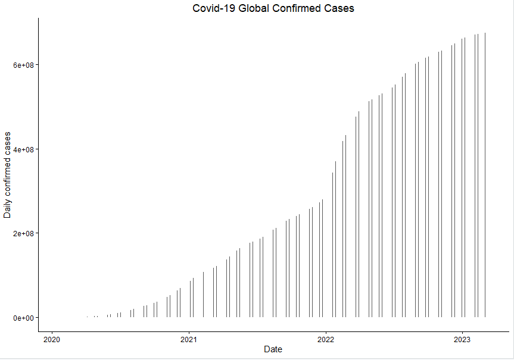{width="90%" height="65%" fig-align="center"}

```{r, eval=FALSE, echo=TRUE}
#COVID Confirmed World Plot
ggplot(world, aes(x = date, y = confirmed)) +
  geom_col(width = 0.8) +
  theme_classic() +
  labs(
    title = "Covid-19 Global Confirmed Cases",
    x = "Date",
    y = "Daily confirmed cases"
  ) +
  theme(plot.title = element_text(hjust = 0.5))
```

\newpage

## Time Series Plots Examples: Shell and BioNtech

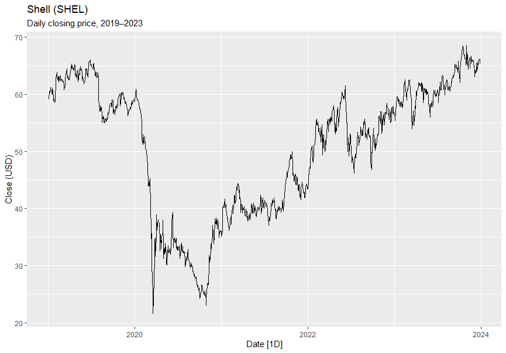

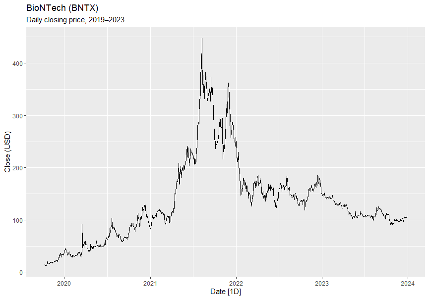{width="75%"}

The *time series plots* can be used to identify initial structural breaks, which become particularly important later in the analysis.

\newpage

## Stationarity Tests

-   ADF test: H<sub>0</sub>: time series is not stationary (unit root), H<sub>1</sub>: time series is stationary

-   Stationary if tau value is smaller than critical value (s=5%)

    **Value of test-statistic is: `-1.2465 2.6347`**

    ### **Critical Values (ADF Test):**

| Test Statistic | 1%    | 5%    | 10%   |
|----------------|-------|-------|-------|
| τ₂             | -3.43 | -2.86 | -2.57 |
| φ₁             | 6.43  | 4.59  | 3.78  |

--\> Not stationary

-   -1.2465 \> -2.86

-   H<sub>0</sub> cannot be rejected

\newpage

## Time Series Becomes Stationary

-   First differences: make the time series stationary

-   remove trend

-   changes in prices with stable variance around the mean

--\> provides reliable basis for future calculations

\newpage

## 

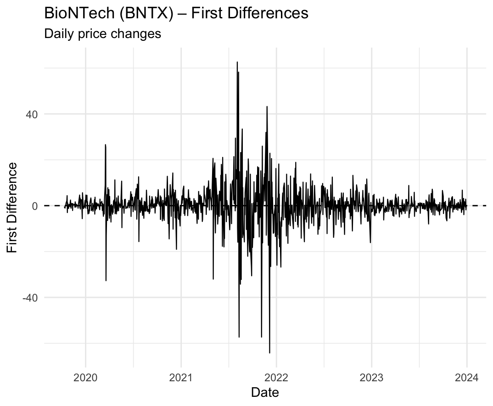{width="100%" fig-align="center"}

## Forecasting (Pre-COVID Benchmark)

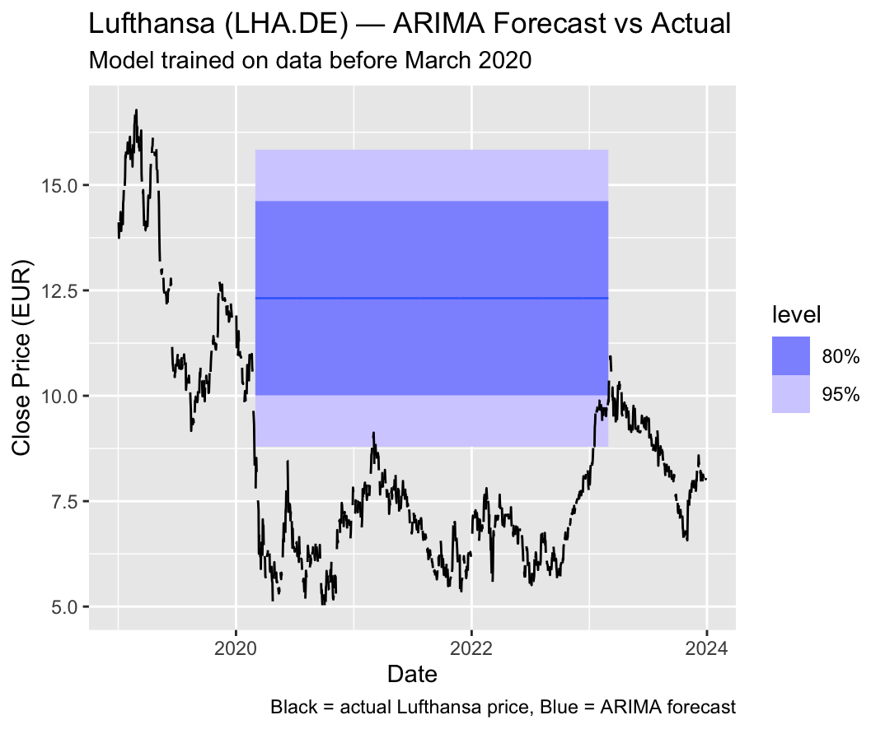{width="90%" height="65%" fig-align="center"}

-   **Our Objective:** To generate a forecast for each stock indicating the range within which it would have traded in the absence of the pandemic

-   We decided for an *ARIMA-model* and therefore used the Website <https://otexts.com/fpp3/arima-reading.html>

-   No continuous timeplot: clean missing dates

-   Missing days: NA dates --\> forward filling

\newpage

## Continuous Forecast

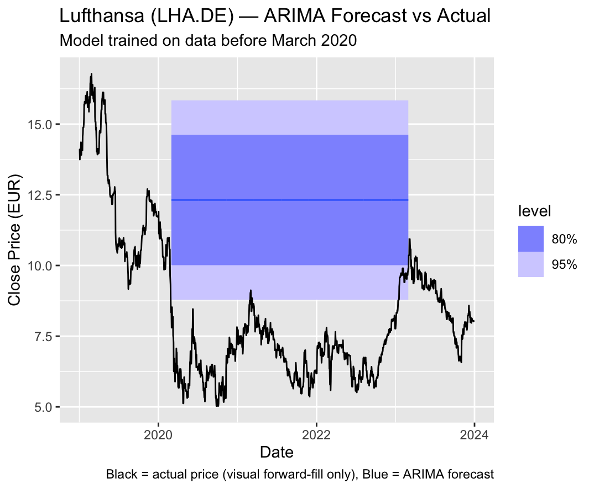{width="90%" height="65%" fig-align="center"}

-   Dark blue: 80% forecast interval

-   Light blue: 95% forecast interval

--\> Range where values are expected

\newpage

## 

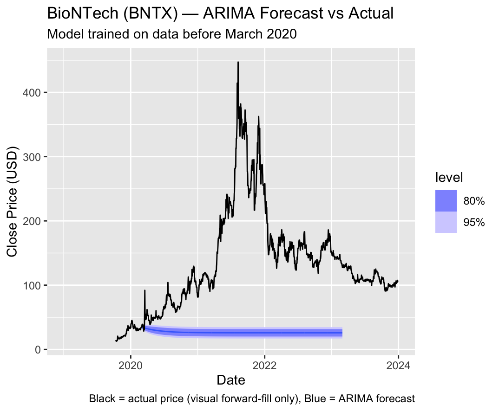{width="90%" height="65%" fig-align="center"}

--\>Limitation: small data set

--\> gross overview, but limitations

-   new solution: monthly forecasts

\newpage

## Forecast as a basis for determining recovery

-   New idea: stock recovered when reaching 80% interval

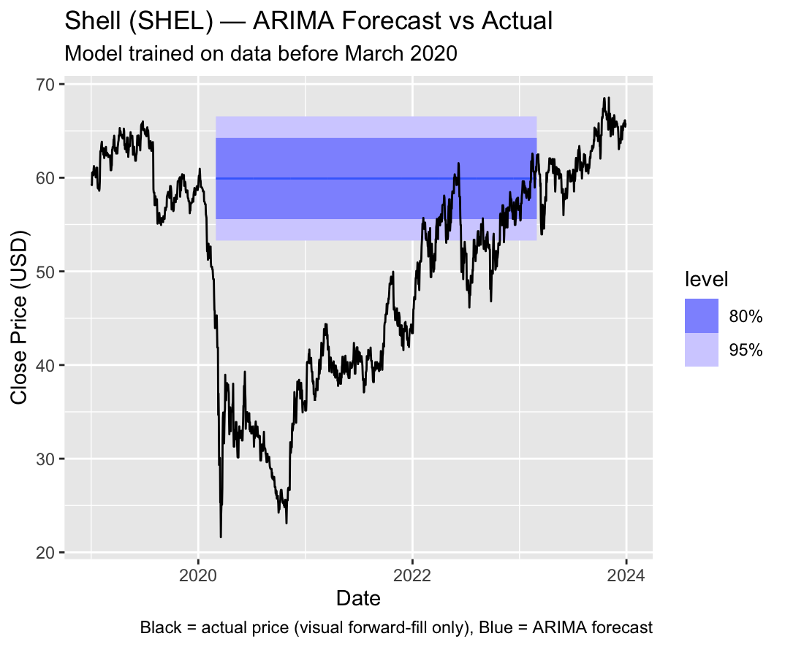{width="90%" height="65%" fig-align="center"}

## Limitations so far

1.  Stock Data set cleaning because of unalligment in rows

2.  Stocks have different currencies –\> not as important at the moment, but could be a problem in the further process

3.  COVID-Data not optional in original form as well –\> break down of data

4.  Generally filtering the enormous amount of data according to our “needs”

5.  Only considering stock prices in relation to confirmed Covid cases, also due to the limited time frame

6.  Should we use the stationarity time series for the further procedure?

\newpage

## Conclusion

-   Rejected the idea of the first question and settled on the current topic.

-   Found, extracted and cleaned of both Data Sets

-   Initial thought: divide the stock data set into quarterly segments

--\> Rejected because it would have simplified/misrepresented our results

\newpage

## 

-   Summarized and compared the data collection in a compatible table

-   Visualization of both data sets

-   Tried on stationary tests

-   Initial creation of forecasts based on the ARIMA model

\newpage

## Further Procedure

1.  Test for long-run relationships (Cointegration)

2.  Analyze short-run dynamics (Granger causality test)

3.  Resulting in: possible sector-specific COVID–market linkages

4.  Robustness checks with alternative specifications (monthly forecast eventually)

\newpage

## List of References

Stock price data obtained from Yahoo Finance via the `quantmod` package

Apple (AAPL): <https://finance.yahoo.com/quote/AAPL>

BioNTech (BNTX): <https://finance.yahoo.com/quote/BNTX>

Lufthansa (LHA.DE): <https://finance.yahoo.com/quote/LHA.DE>

Shell (SHEL): <https://finance.yahoo.com/quote/SHEL>

<https://github.com/CSSEGISandData/COVID-19>

Path of Confirmed cases (global): csse_covid_19_data/csse_covid_19_time_series/time_series_covid19_confirmed_global.cs

Path of Deaths (global): csse_covid_19_data/csse_covid_19_time_series/time_series_covid19_deaths_global.csv

<https://otexts.com/fpp3/arima-reading.html>
